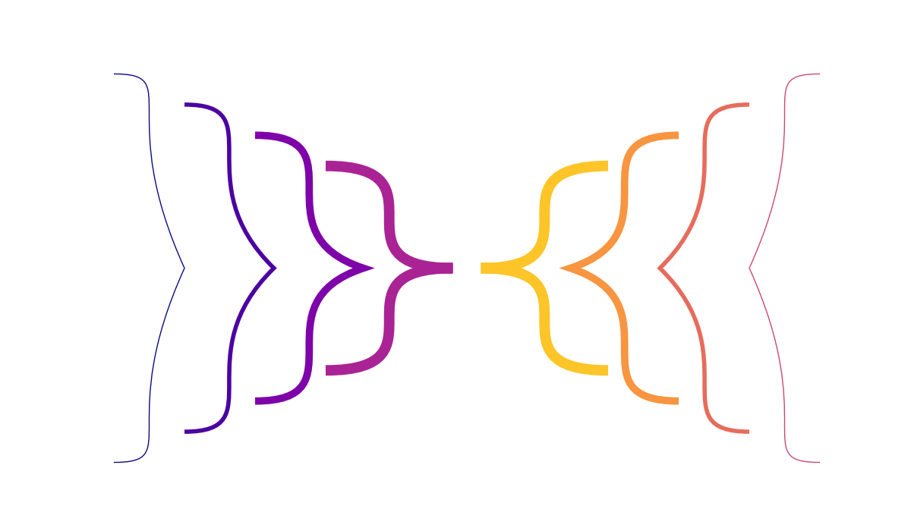

A matplotlib patch for drawing a curly brace. See docstring for usage details.

The history
-----------
I wanted to draw a curly brace ("}") onto a figure and was unsatisfied with the option of using text, since that creates a fairly thick and uniform curly brace that cannot be modified.

After searching around a bit, I drew one manually in Inkscape and realized that it can be described surprisingly simply using Bezier curves.

So I messed around and realized that the "Bezier parameterization" of the curly brace is incredibly simple. It involves just two 2-control-point Bezier curves which are mirror images, and therefore just one free parameter corresponding to curliness. It was interesting to discover that I had, by eye, chosen almost exactly 1/e for this value.
